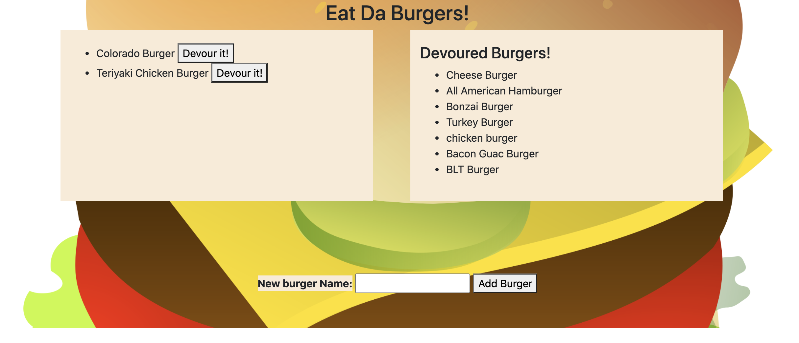

# Burger


## Description
You can add burgers and when you click on the Devour it button it will move it to a devoured list. 

## Links
Deployed link: https://cryptic-tor-81296.herokuapp.com/ 

Repo link: https://github.com/jttilley/burger

## Author
Jason Tilley

## Tech Used
HTTP, CSS, JavaScript, Bootstrap, jQuery, Ajax, ES6, Node.js, express, express handelbars, orm, mysql

## Table of Contents
* [Example](#example)
  
  
  * [Installation](#installation)
  
  * [License](#license)
  
  * [Tests](#tests)
  
  * [Questions](#questions)
    

## Example


## Installation
To install the necessary denpendencies, run the following command:
```
npm i
```

## License
The license for this project is: *MIT* ©  2020 Jason Tilley
  

## Tests
Run the live link and add new burgers or devour some on the list.

## Questions
If you have any questions you can email me at: jttilley007@gmail.com

Also feel free to check out my GitHub page here: https://github.com/jttilley
  

